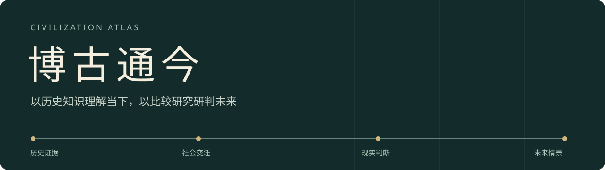

<p align="center"></p>

<p align="center"><b>历史知识库 × 比较历史 × 复杂系统 × 趋势与决策</b></p>
<p align="center"><a href="#快速开始">快速开始</a> · <a href="#知识版图">知识版图</a> · <a href="#如何博古通今">如何博古通今</a> · <a href="knowledge-base/reports/coverage.md">覆盖报告</a> · <a href="SKILL.md">Skill 内核</a></p>

## 让历史成为理解现实的依据

**博古通今，是这个 Skill 的立场。** 从历史留下的制度、技术、人口、资源和社会关系中理解变化，把过去的经验转化为审视当下、研判未来的证据与问题。

Civilization Atlas 将可检索的历史知识库、比较研究方法和预测评估工具装进同一个 Skill。研究从具体资料出发：核对发生了什么，比较形成条件，再判断哪些机制可能延续、哪些条件已经改变。

## 知识版图

随 Skill 提供可离线检索的数据快照、原始资料定位与本地浏览器。首次查询自动校验并解压数据库到本机缓存，无需单独搭建数据库服务。

| 已接入内容 | 当前规模 | 主要用途 |
|---|---:|---|
| Seshat 历史社会资料 | 626 个政体 · 42 个来源区域 · 58,430 条记录 | 制度、社会结构、军事技术、宗教与危机 |
| 世界银行长期指标 | 87,450 条记录 · 5 项指标 | 人口、经济、寿命、城市化、互联网普及 |
| NASA 全球温度序列 | 147 条记录 | 1880—2026 年温度资料；未完成年度保留缺测 |
| 历史事件编纂 | 72 条 | 历史线索与机构来源追溯 |

**合计 146,099 条来源记录。** 数量包含缺测、元数据和作者编码，不等于独立史实数，也不表示全球历史已经完整覆盖。世界银行记录区分 217 个国家／经济体和 48 个聚合组。

进一步查看：[覆盖与缺口](knowledge-base/reports/coverage.md) · [地区—时期矩阵](knowledge-base/reports/region-period-coverage.csv) · [数据来源与许可](knowledge-base/ATTRIBUTION.md)。COW 战争与联盟资料提供官方入口，受其再分发条件限制，不包含在随包快照中。

## 快速开始

### 在 Codex 中安装

```sh
git clone https://github.com/JuneYaooo/civilization-atlas-skill.git
cd civilization-atlas-skill
python3 scripts/install_skill.py
```

在支持 Skill 的会话中调用 `$civilization-atlas`。安装程序默认使用 Codex 技能目录；`--dest` 可指定其他技能父目录，已有同名安装时停止覆盖。

### 下载或生成 Skill 安装包

[下载含知识库的 ZIP 安装包](https://github.com/JuneYaooo/civilization-atlas-skill/releases/download/knowledge-2026-09-25/civilization-atlas-knowledge-20260925.zip) · [查看发布版本](https://github.com/JuneYaooo/civilization-atlas-skill/releases/tag/knowledge-2026-09-25)

也可在本地生成：

```sh
python3 scripts/install_skill.py --zip dist/civilization-atlas.zip
```

ZIP 包含 Skill、知识库和查询工具。WorkBuddy 提供本地技能包导入入口，操作见[官方技能安装说明](https://www.workbuddy.cn/docs/workbuddy/From-Beginner-to-Expert-Guide/Function-Description/Skills-Market)。

### 直接查看知识库

```sh
python3 knowledge-base/scripts/serve.py
```

打开 `http://127.0.0.1:8765`，按关键词、主体、年代、主题和来源筛选。点击记录可查看原始字段、出处、文件摘要与行号。

```sh
python3 knowledge-base/scripts/query.py coverage
python3 knowledge-base/scripts/query.py search --help
```

Python 3.9+，仅使用标准库。外文数据优先按原文名称检索，中文名称映射仍在补充。

## 如何博古通今


| 研究环节 | 要回答的问题 |
|---|---|
| 历史证据 | 资料由谁记录？当时的制度、技术和资源条件是什么？ |
| 条件比较 | 相似情形为何产生不同结果？有哪些反例？ |
| 复杂系统 | 哪些约束主导变化？反馈、时滞和外部冲击怎样作用？ |
| 现实迁移 | 哪些关系仍可能成立？哪些因技术、制度或主体变化而失效？ |
| 决策与复盘 | 有哪些可行选项？什么信号会使判断需要修改？ |

周易的时位、关系与变通思维用于提出研究问题；经验结论仍由史料、观测和检验支持。预测工具可以冻结二元任务、概率和结果，并比较同题 Brier 评分。

## 在 WorkBuddy 中实际使用

已在 WorkBuddy 5.6.2（GLM-5.3-Flash）验证技能识别、内嵌史料查询和数值回放程序执行。下面是安装、史料检索、回放指标与失败案例的真实截图步骤演示；GIF 为截图序列，非连续录屏。


[观看约 15 秒的 WorkBuddy 结果浏览视频](assets/workbuddy/results-browsing.mp4)（真实窗口采样录制，无音频，展示运行完成后的指标与失败案例）。

三条史料的记录 ID 与来源行号可复核；全量数值回放也与公开脚本结果一致。实测同时发现了参数调用和人口区间表述问题，详见[截图、复核记录与运行结果](demos/workbuddy/README.md)。

## 历史回放：能预测多准？

先用可复现的数值基线检查，而不是只展示命中的故事。对 5,425 个国家—指标—截点组合做五年外推，4,766 题可结算。线性趋势在部分指标上优于保持不变，但在实际人均 GDP 上整体 MAE 更高。

固定展示题中，中国城市化的方向相符；日本人口与巴西实际人均 GDP 的方向判断均失败。**这些是数值基线回放，不是 Skill 或 WorkBuddy 的预测准确率。** [查看完整结果、失败题目与复现脚本](demos/historical-replay/README.md)。

## 能力的边界

历史可以约束判断，但不能保证未来重复过去。本项目尚未证明通用预测准确性；历史回溯也不能自动证明事前预测能力，尤其要警惕模型已知后续事件与后来修订的数据。

当前资料在前现代经济人口、疾病灾害、科技突破及原文证据链方面仍有明显缺口。属性未注明年代时，不用政体持续期补成逐年观测。完整采集路线见[知识库建设计划](knowledge-base/docs/collection-program.md)。

## 继续深入

[历史与证据](references/history-and-evidence.md) · [复杂系统](references/complex-systems.md) · [预测与决策](references/forecast-and-decision.md) · [周易转译](references/yijing.md) · [数值预测登记](references/binary-registry.md)

程序按 [MIT](LICENSE) 分发；原创方法说明采用 [CC BY 4.0](https://creativecommons.org/licenses/by/4.0/)，署名 Civilization Atlas contributors。第三方数据分别适用其来源条款，详见[来源与许可](knowledge-base/ATTRIBUTION.md)。
