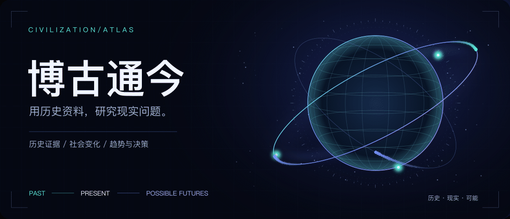
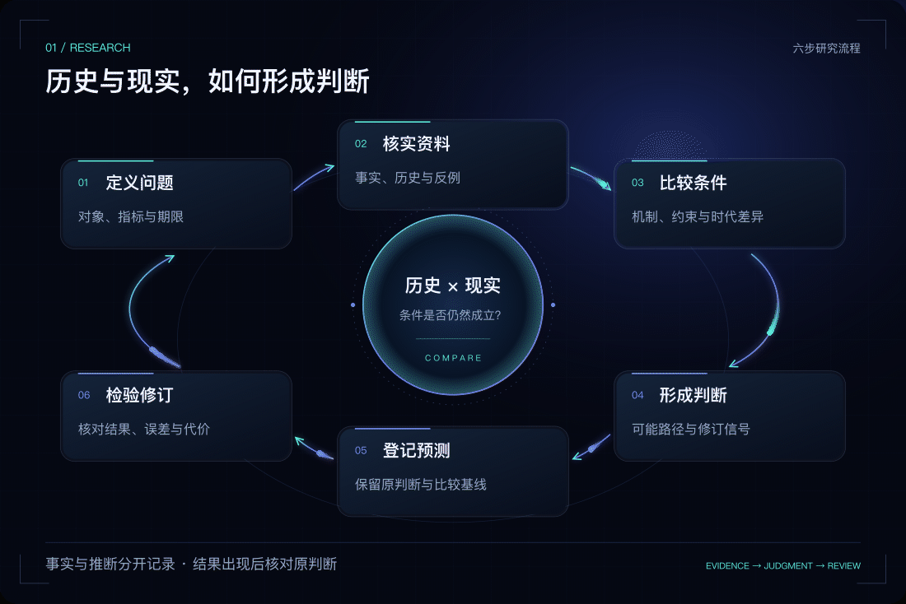
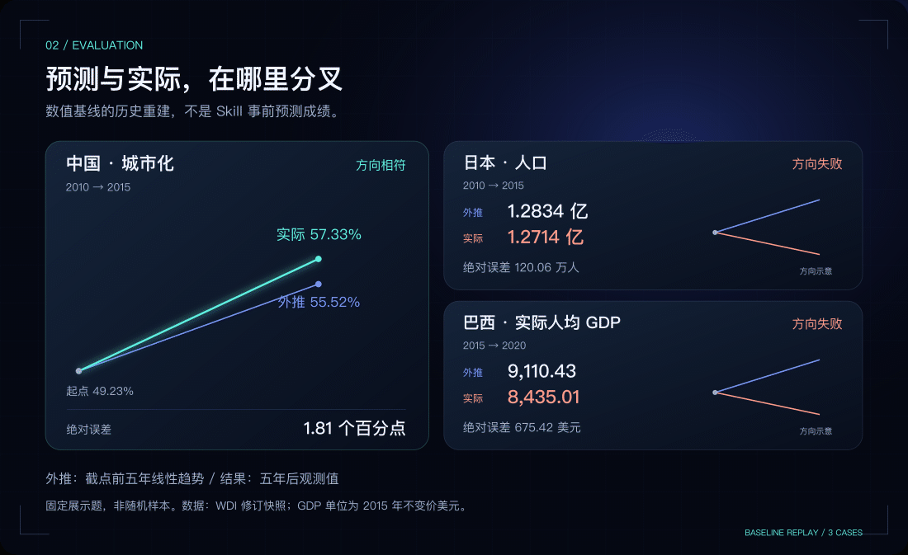

<a href="#能做什么">能做什么</a> · <a href="#历史怎样帮助判断">研究方法</a> · <a href="#案例与效果">案例与效果</a> · <a href="#使用前需要知道">局限与风险</a> · <a href="INSTALL.md">安装使用</a>

## 博古通今

Civilization Atlas 是一个用历史研究现实问题的 AI Skill。它把历史资料、当下信息和比较分析结合起来，帮助你理解一件事为什么发生、接下来可能怎样发展，以及做决定时需要考虑什么。

你可以问它：一项技术突破会改变哪些行业？一场危机会通过什么途径影响生活？历史上处境相似的人，做决定时考虑了什么？

它会查资料、寻找不同的历史对照，比较今天的条件，再给出可能的发展路径、判断依据和需要继续观察的信号。需要在支持 Skill 的 AI 工具中使用，联网检索由所在工具提供。

## 能做什么

| 你关心的问题 | 它能帮助你研究什么 |
|---|---|
| 最近发生了一件大事，会有什么影响？ | 核实事件，梳理对行业、地区和不同人群的影响，区分直接冲击与后续反应。 |
| 一个行业正在快速变化，机会在哪里？ | 比较历次技术与制度变迁，检查需求、成本、采用速度和竞争，判断机会成立的条件。 |
| 同一个趋势，为什么各国走向不同？ | 比较人口、资源、制度、产业和社会关系，找出制约各地发展的关键差异。 |
| 面临职业或人生选择，历史有什么参考？ | 寻找处境与约束相近的决策，分析取舍、代价和退路，而非照搬历史人物的选择。 |

## 历史怎样帮助判断

**先找相似之处，再检查不同之处。** 比较疫情时，除了病原特征，还要看交通网络、检测能力、响应速度和公众行为；比较技术革命时，要区分技术能做什么、组织是否采用，以及谁能获得收益。

**寻找反例，并比较多种解释。** 一个历史故事很容易支持一种观点。研究需要同时寻找不同结局，检查哪些条件改变了结果。资料包括统计、研究、历史记录、报道与个人见闻；具体经历提供线索，其代表性仍需核实。

**把判断写成可以检查的预测。** 明确对象、期限和指标，留下原始判断，再与实际结果和简单预测方法比较。证据不足时，保留未知；条件改变时，说明为何修订。

涉及人性、合作、冲突与社会演进时，也可借助周易的时位、进退与变化观念提出问题。它在这里是思考工具，经验判断仍需要证据，没有被证明能提高预测准确率。

### 有哪些资料可用

随包知识库为 **2026-09-25 构建的快照**，提供 **146,099 条来源记录**，涵盖历史社会结构、人口、经济、城市化、互联网普及和气候资料。包括 Seshat 的 626 个政体、世界银行的 217 个国家／经济体及聚合组，另有历史事件与人物决策索引。记录保留出处，方便回查；近期问题还需要补充在线资料。

这些记录包含缺测、元数据和作者编码，不等于同样数量的独立史实。疾病、灾害、科技突破和部分早期历史的覆盖仍不足。[查看覆盖范围与缺口](knowledge-base/reports/coverage.md)。

## 案例与效果

### 房地产：行业扩张，不等于房价以相同速度上涨

以 1998 年住房制度改革为起点，分别研究制度、融资、支付能力与城市化对开发投资和价格的影响。1998—2003 年，名义房地产投资增长 **180.94%**，商品住宅平均销售价格增长 **18.50%**。两者的差异说明，判断行业机会时必须先说清楚预测的究竟是什么。[完整分析与来源](demos/three-question-rerun/housing.md)。

### 疫情：测序更快，能否让传播更快受控？

同时参照 SARS 的控制经验和 H1N1 的扩散经验，检查传播是否早于发现、检测与追踪能否覆盖感染者，以及容量是否足够。国际旅游到达数在 2020 年下降 **74%**，2021 年仍比 2019 年低 **72%**（当时发布口径）。快速识别病原体，没有自动带来社会活动的快速恢复。[完整分析与来源](demos/three-question-rerun/covid.md)。

### AI：任务提效，距离行业收益还有多远？

借鉴计算机与自动化的历史，逐步检查能力、采用、核验成本、需求和收益归属。特定写作实验报告耗时减少 **40%**，另一项早期 2025 编程实验却报告耗时增加 **19%**。任务、对象与时期不同，结果不能直接作因果比较，也不能代表当前所有 AI 工具；它们说明为何需要检验具体工作条件。[完整分析与后续更新](demos/three-question-rerun/ai.md)。

**以上是已知结局后的历史重建，展示研究方法，不是当年作出的预测，也不计命中率。** [查看三题的推理步骤](demos/prediction-cases/README.md)。

### 目前验证到了哪一步

以下状态核对于 2026-10-09，研究与测试记录按各自执行日期保留。[全部案例与验证记录](demos/README.md)。

项目对 **5,425** 个国家—指标—时间点组合做了五年趋势外推，**4,766** 题有数据可核对，其余因缺测无法结算。简单线性趋势在部分指标上优于保持不变，但在实际人均 GDP 上误差反而更大。上图是固定展示题，数据使用后来修订的快照，**不能据此给出本 Skill 的预测准确率**。[完整结果与复现方法](demos/historical-replay/README.md)。

另核对了一次真实的外部预测：SMMT 在 2023 年预计英国 2024 年纯电新车份额为 **22.3%**，实际为 **19.6%**，高估 **2.7 个百分点**。本项目也已登记四国 2027 年第一季度纯电新车份额的验证题，但尚未提交预测、尚无成绩。[预测与验证记录](demos/ev-validation/README.md)。

## 实际使用

在 WorkBuddy 中已验证技能识别、史料查询和数值回放。下面是实际操作的截图序列，非连续录屏。

研究欧洲电动车采用差异时，实测发现了来源核查不足和因果表述过强的问题，经过人工复核与追加指令后修订。实际使用仍需审阅关键依据。[查看实测记录](demos/workbuddy/review-20261009.md) · [观看结果浏览视频](assets/workbuddy/results-browsing.mp4) · [安装使用](INSTALL.md)

## 使用前需要知道

- **尚未证明预测优势。** 历史重建、程序运行通过和真实事前预测是不同的验证；目前没有证据证明本项目能稳定胜过简单基线或改善决策收益。
- **相似历史可能导向不同结局。** 技术、制度与人的行为会变化，类比成立的条件需要逐项检查，不能套用历史日期、涨幅或成功路径。
- **资料与 AI 都会出错。** 知识库有缺口，在线资料可能冲突或过时，AI 可能误读来源。重要判断应回查原文，区分事实、推断和未知。
- **判断方向不等于选对行动。** 行业增长不保证企业盈利，趋势成立不保证投资回报；实际决策还受成本、时机和个人约束影响。

## 进一步了解

[Skill 指令](SKILL.md) · [研究方法](references/mechanism-transfer.md) · [知识库来源](knowledge-base/ATTRIBUTION.md) · [案例与验证索引](demos/README.md)

程序按 [MIT](LICENSE) 分发；原创方法说明采用 [CC BY 4.0](https://creativecommons.org/licenses/by/4.0/)，署名 Civilization Atlas contributors。第三方数据适用各自来源条款。
