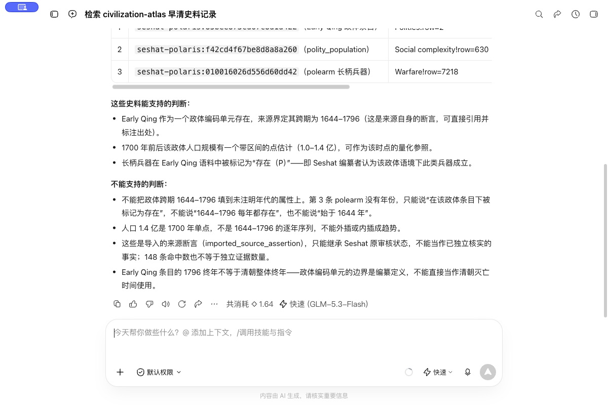
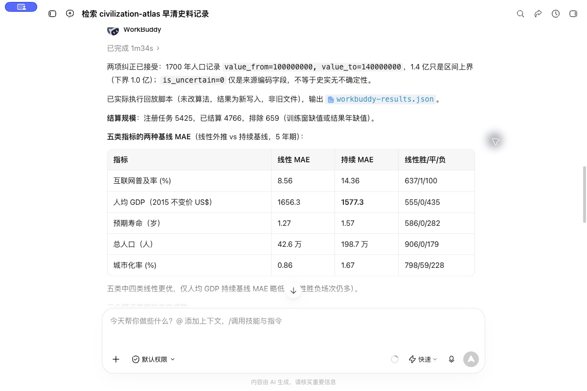
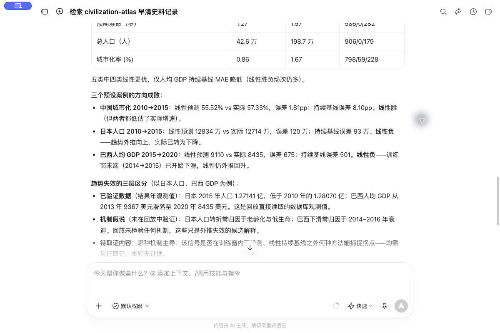

# WorkBuddy 实机演示

环境：WorkBuddy 5.6.2，快速模式（客户端显示 GLM-5.3-Flash），2026-09-25。技能通过本地目录安装，在客户端的“我安装的”中显示为启用。

## 史料检索

提问：使用 civilization-atlas，实际读取技能并查询 Early Qing，返回三条记录的 ID、原始文件行号和年代，解释能支持与不能支持的判断。

客户端读取了 `SKILL.md` 和 `references/knowledge-base.md`，检索返回 148 条关联记录，并回读了三条详情。复核结果：

| 记录 | 来源定位 | 数据含义 |
|---|---|---|
| `seshat-polaris:85bee873cd67c8d1d422` | `Polities!row=2` | Early Qing 编码单元的起止为 1644—1796，不代表清朝整体终年 |
| `seshat-polaris:f42cd4f67be8d8a8a260` | `Social complexity!row=630` | 1700 年人口区间为 1.0—1.4 亿，不是逐年序列 |
| `seshat-polaris:010016026d556d60dd42` | `Warfare!row=7218` | polearm 字段为 P，年份为空，不能回填政体起止年 |

原始文件为随包提供的 `seshat-polaris-cf60c9f76eeda6db.xlsx`。记录属于来源作者编码，尚未逐条独立核实。

实际运行并非没有错误：首次详情查询误用了 `record --id`，随后查看帮助改用位置参数。第一版回答保留了人口区间，却在后文简称为“人口 1.4 亿”，并把来源标记概括为“非不确定”。复核时明确纠正：1.4 亿只是上界，`is_uncertain=0` 不等于史实不存在不确定性。截图保留真实原答，不能把这些措辞当作复核结论。

## 可复现数值回放

给 WorkBuddy 一个仅包含公开数据和既有回放脚本的本地工作目录，要求实际执行 `replay.py --output workbuddy-results.json`，不改算法，不读取旧结果代替执行。回放协议和全量题目见[历史回放](../historical-replay/README.md)。

新结果于 2026-09-25 13:14:20 UTC 生成。逐字段比较后，除生成时间外，与仓库公开的全部回放结果一致：5,425 题登记、4,766 题结算、659 题因数据缺失排除。[本次运行摘要与文件校验值](run-receipt.json)。这验证了客户端能够调用既有回放程序，不证明历史研究方法提升了预测能力。

| 指标 | 线性外推 MAE | 保持不变 MAE |
|---|---:|---:|
| 互联网普及率 | 8.564 个百分点 | 14.360 个百分点 |
| 实际人均 GDP | 1,656.277 美元（2015 年不变价） | 1,577.308 美元 |
| 预期寿命 | 1.266 年 | 1.573 年 |
| 人口 | 425,837 人 | 1,986,609 人 |
| 城市化率 | 0.858 个百分点 | 1.671 个百分点 |

三个预设题：中国城市化 2010→2015 方向相符；日本人口 2010→2015、巴西实际人均 GDP 2015→2020 方向均失败。使用后来修订的数据、模型可能已知历史结局等问题仍然存在，不能称为当年的事前预测。

## 第二轮回答复核

第二轮回答接受了人口区间与来源不确定性标记的纠正，并展示了新生成文件、结算规模、五类误差与三个预设案例。表中百分比指标的 MAE 应读作“百分点”，不是相对百分比误差。

回答将日本人口、巴西人均 GDP 的变化与机制解释分开：人口老龄化、低生育和经济衰退仅作为候选解释，没有声称这些机制已由本次回放验证。要检验解释是否有预测增益，还需要当时可得的解释变量、预先固定的模型和独立测试集。

截图中的“线性胜／负”表示与保持不变基线比较的绝对误差大小，不等于方向是否正确；本次三个案例的方向判断需要单独与起点值比较。对中国城市化，两者低估的是五年累计变化，回放没有逐年估计增速。

## 步骤演示

以下 GIF 由四张真实客户端截图按步骤合成，每帧停留 6 秒；不是连续录屏，也没有重绘或模拟客户端输出。

