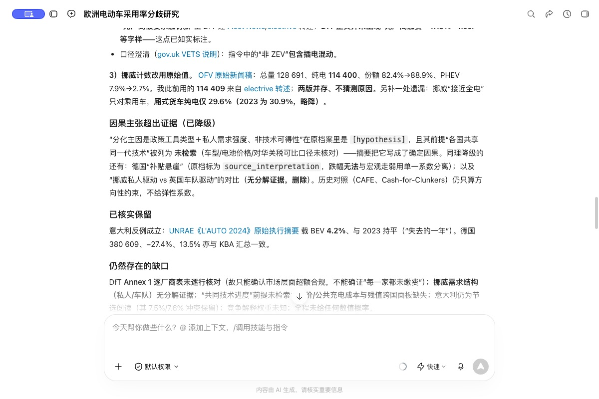

# WorkBuddy 研究实测与纠错

2026-10-09，WorkBuddy 5.6.2，客户端显示快速模式 Deepseek-V4.1-Flash。任务是解释2023—2024年欧洲电动车采用分化，核查德国、英国、挪威，并主动寻找反例、比较历史机制。未向客户端提供既有报告或标准答案。输入自动化首次产生不完整文本，取消后改用完整英文问题，要求中文回答。

## 实际表现

| 阶段 | 观察 | 判定 |
|---|---|---|
| 首轮，6分6秒 | 读取Skill与参考协议、实际搜索、建立13条检索回执与23条证据、冻结报告；选意大利作反例 | 未通过内容审核：摘要将假说升级为因果，混用份额与合规，填写不实精确访问时间 |
| 定向复核，4分钟 | 更新入口规则后指出疑点，客户端重新查OFV、DfT、UNRAE等来源，追加更正，证据增至28条 | 关键事实改善；时间记录仍不可靠，不能视作完整通过 |
| 时间记录修正与程序复测，55秒 | 引擎增加未来活动时间拦截；客户端在隔离目录验证拒绝未来访问/复盘时间，并用系统时间追加撤回记录 | 指定故障已复测；不证明所有时间真实或研究结论正确 |

第二、三轮含审阅者提示和Skill更新，属于有人指导的纠错，不是独立盲测，也不能据此单独估计Skill更新的效果。客户端首轮能搜索和写记录，但不能可靠地自行完成语义审核。

## 关键修正

英国市场注册份额不能直接代替监管合规结果。[DfT正式报告](https://www.gov.uk/government/publications/vehicle-emissions-trading-schemes-vets-final-compliance-information-2024)显示2024年乘用车与货车市场均超额合规；报告正文列出乘用车19.8%的ZEV注册份额及转换、借入等安排。不能据此编出适用所有厂商的统一销量门槛，也不能从市场整体结论推出每一家厂商的缴费情况。

“政策工具和私人需求是分化主因”仍是候选解释。车型价格与可得性、收入、充电成本、残值、需求结构等竞争因素没有充分区分；历史对照不提供今日的因果系数。挪威计数版本分别保留，不能自行猜测差异原因。尚未核验商业收益，也没有事前预测成绩。

截图为第二轮实际回答的窗口画面，未重绘、改字或模拟输出；展示已检查的片段，不代表整份回答通过审核。该轮时间元数据随后被第三轮撤回。截图中的历史机制概括仍是待检验的迁移假说，不能视为通用规律。

## 落实到工具的改动

- 摘要不得提高正文的证据强度；制度目标、观测指标与履约结果分别核对。
- 搜索与访问时间不凭推测填写；不得为通过校验改变信息制度或放宽取证资格。
- 新写入的搜索、访问、复盘时间晚于本机当前时间时拒绝；旧冻结记录仍可验真，不追溯修改。

本地36项研究工具测试通过，包括新增未来时间拦截、时区等价和拒绝后不落盘检查。该检查依赖本机时钟，不能认证过去时间的真实性；搜索范围、引用相关性、因果推断仍需内容审核。

[运行摘要与原记录文件校验值](review-20261009-receipt.json)。文件摘要用于核对版本，不是第三方时间认证。旧材料原样保留，纠正另行追加。
