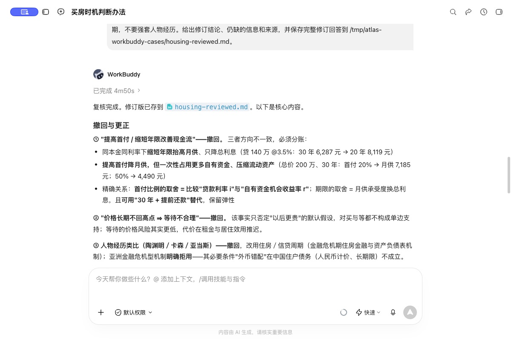
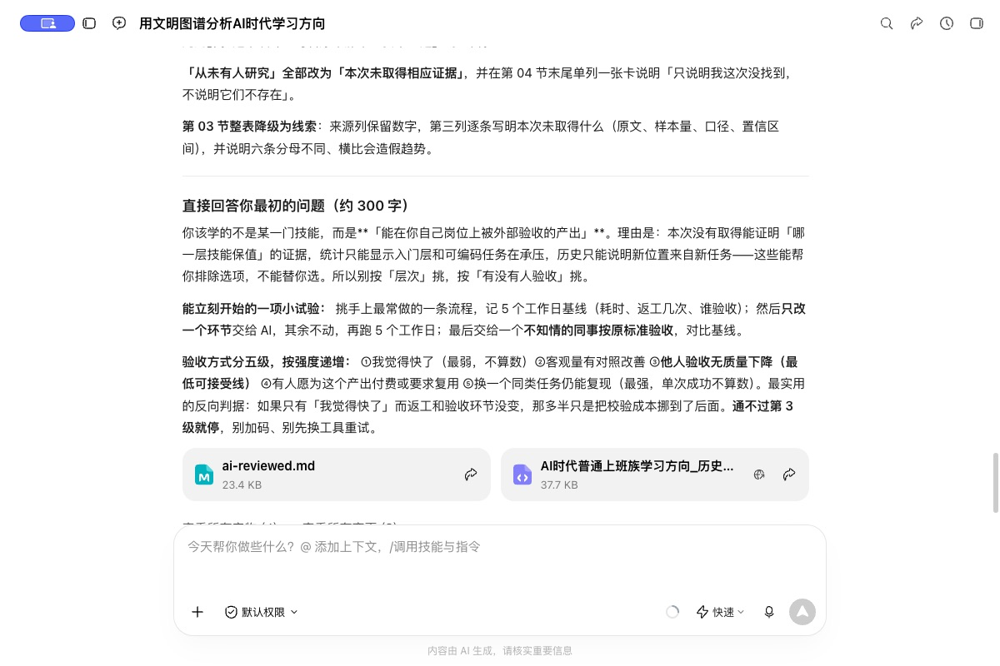
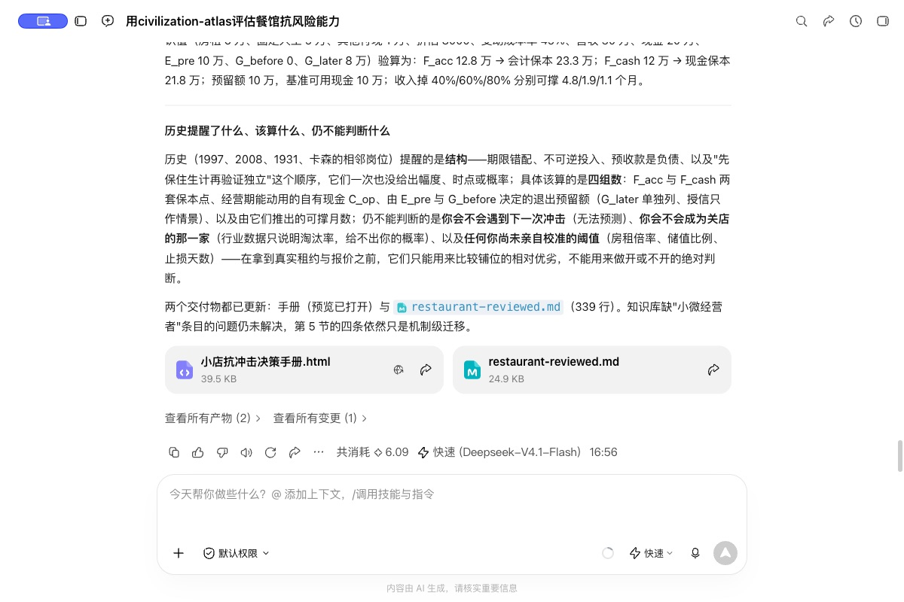

# 三个日常问题：WorkBuddy 实测与复核

2026-10-09，WorkBuddy 5.6.2，客户端显示“快速（Deepseek-V4.1-Flash）”。本轮安装包含扩充后的 219,964 条来源记录。三道初始问题分别建立独立对话，未在问题中预设答案；初答后由评审指出具体错误，追加复核。以下是**有人工指导的使用测试**，不是独立盲测、事前预测或准确率评估。

## 买房：现在买，还是再等？

实际提问：

> 用 civilization-atlas 帮我想想：房价已经跌了几年，现在买房还是再等等？我是想长期自住的普通家庭，最怕买完继续跌，也怕一直等下去。城市和预算还没定，先结合历史经验给我一个判断办法。

初答用时 4 分 20 秒；一次追加复核用时 4 分 50 秒。客户端生成了研究记录与 Markdown 报告，并实际追加了修订。

**有用的部分**：把“找最低点”拆成居住需求、现金流、资产损失与退出成本；承认全国指数不能代替具体板块，未给出买入点或涨跌概率。

**初答的问题**：把提高首付和缩短期限一并当作改善现金流；从日本长期不回高点推出等待不合理；用人物经历类比住房决策；部分当前数字只凭摘要即称为核实。

复核明确要求检查同本金同利率下的月供方向、同时比较买和租、打开官方原文并撤回核不到的数字。实际修订撤回了前两条推论，改用住房／信贷周期，并展示了月供算例。假设贷款 140 万元、年利率 3.5%、等额本息，30 年月供约 6,287 元，20 年约 8,119 元；这里的利率仅是计算输入。

**仍需核查**：截图中的“精确关系”过度简化了首付选择，风险、税费、流动性和贷款合同同样重要；提前还款也受合同限制。修订报告对政策影响仍有过强表述，政策原文、适用项目与实际执行需分别核验。本页不把客户端所称的“已核实”当成独立审计通过。缺少城市、租金、收入与真实合同，尚不能完成个人租买比较。

## 学习：AI 会不会让现在学的东西很快失效？

实际提问：

> 用 civilization-atlas 帮我分析一下：AI 越来越能干，普通上班族接下来到底该学什么？我担心现在花时间学的东西，很快又被 AI 做掉。以前机器、电脑和互联网普及时，普通人怎么找到新的位置？哪些经验今天还管用，哪些已经不一样了？希望你给几个能开始尝试的方向，也说清楚风险。

初答用时 7 分 47 秒；第一轮复核用时 1 分 27 秒，第二轮同步修订 HTML 与摘要用时 2 分 7 秒。界面可见论文下载、文本提取、线上来源阅读和研究记录生成。

**有用的部分**：比较自动化替代、新任务创造、组织采用和工资分配；保留经济史测量分歧，没有把工业革命当成单一故事。

**初答的问题**：“别再学中间层”“某类岗位最后被替代”“职业寿命更长”都超出了所引证据；跨职业相关不能直接支持个人职业处方，美国样本不能直接代表中国具体岗位。

追加复核要求分开统计观察、机制假设与个人试验，撤回未经核验的近期数字，并保留基础练习可能形成判断能力的竞争解释。客户端撤回了三条强结论，转向在具体工作里比较耗时、返工与验收结果；2—4 周等时长被标为自设起点，末轮摘要改为各 5 个工作日，均未经校准，未声称是校准标准。第二轮追问同时纠正“历史和统计不能作为行动依据”的过度纠偏：它们可以约束候选方案，但不足以单独推出普遍处方。

**仍需核查**：自我前后比较容易受任务难度和熟练度变化干扰；愿意付费、质量达标、可重复是不同评价维度，不能简单排成统一五级。需要可比任务、完整成本和独立验收，尚未开展真实工作场景的效果试验。

## 开店：遇到冲击时，怎样给自己留退路？

实际提问：

> 用 civilization-atlas 帮我想想：我想开一家小餐馆，但看到疫情那几年很多店撑不下去，有点不敢开始。如果以后再遇到类似冲击，普通小店有没有办法提前看出风险、给自己留条退路？结合以前的真实经历说说，别只告诉我要准备现金。我还没选城市和店面，先想明白该怎么算这笔账。

初答用时 2 分 52 秒；两次追加复核分别用时 2 分 59 秒、2 分 35 秒。客户端生成了可输入成本的 HTML 手册，并两次更新计算与说明。

**有用的部分**：把风险提前到租约、固定承诺、收入来源和退出安排；明确缺少同类小微经营者条目，宏观危机只能提供有限的机制参照。

**初答的问题**：把关店回收加进经营现金，将折旧混入现金消耗，给出无校准的统一红线，用单店幸存故事作因果解释，并编造“没有保底收入则抗跌深度减半”的换算。第一次修订又出现退出成本重复扣减、到账时点未分开的错误。

两轮复核分别要求核实统计分母与关闭口径、分开会计和现金，再按付款时点拆开退出支出与回收；可撤销授信只作情景。最终界面显示：

- 经营现金与会计损益分开；后来才能回收的金额不提前支付眼前的费用。
- 退出前支出与付款前确定可到账的回收分别列示，后续不确定回收单列。
- 无校准依据的阈值退回可调假设，删除无依据的历史绝对句。

**仍需核查**：模型假设贡献率与固定支出不随收入下降改变，未完整处理季节性、债务偿付、税费时点及供应链中断。现金不足以覆盖退出预留时应判为已有缺口，不能把负的“可撑月数”当作时间。截图里的“无法预测”应读作本次没有形成可验证预测，不是证明冲击在原理上不可预测。还缺真实商户群体、失败与幸存对照，不能给出开店成功率。

## 本轮对 Skill 的改动

在[决策协议](../../references/forecast-and-decision.md#数值建议的语义核对)补充数值建议核对：检查量纲与变化方向、收付时点、行动的双向代价和阈值依据；入口增加直接相关历史对照优先于牵强人物类比的要求。

上述改动来自已观察到的错误。追加复核明确提示了错误，不能据此宣称新版能独立避免同类问题；还需要新题、不提示错误的留出测试。本轮知识库扩充也未做同题对照，不能把回答变化归因于新增记录。

三组截图是客户端实际画面，不是生成的界面效果图。它们保留模型措辞，具体解释以本页的复核与限制为准。未把完整生成报告当作经过独立核实的知识条目入库。

[返回项目介绍](../../README.md) · [知识库新增内容](../../knowledge-base/reports/expansion-20261009.md) · [全部验证记录](../README.md)
